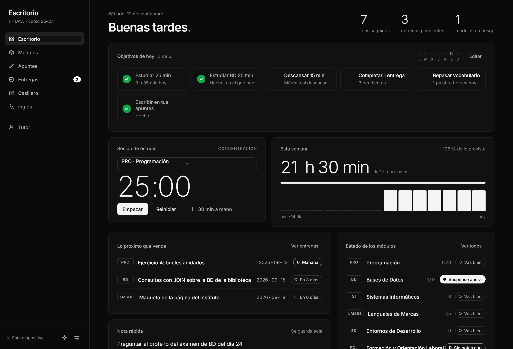
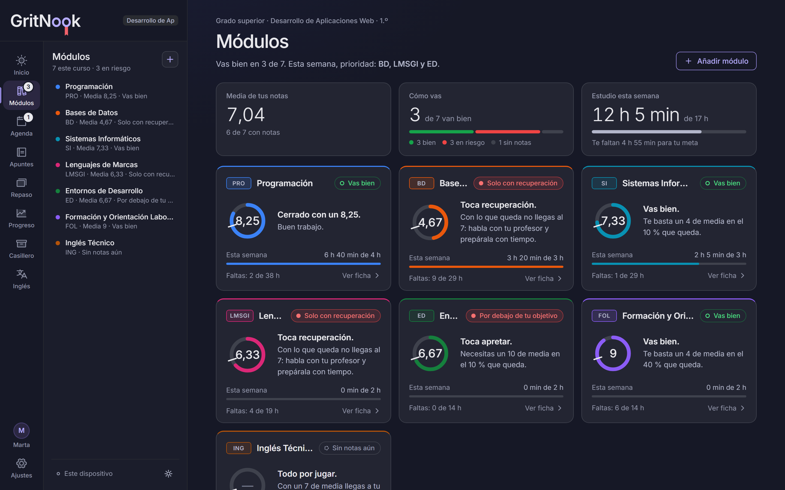
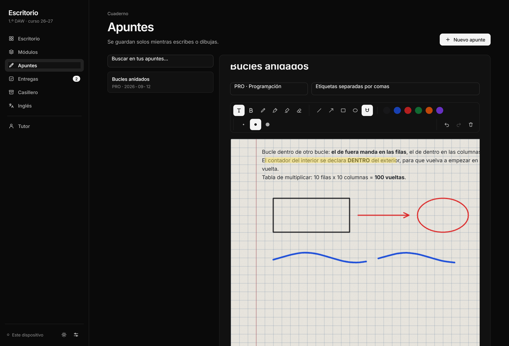
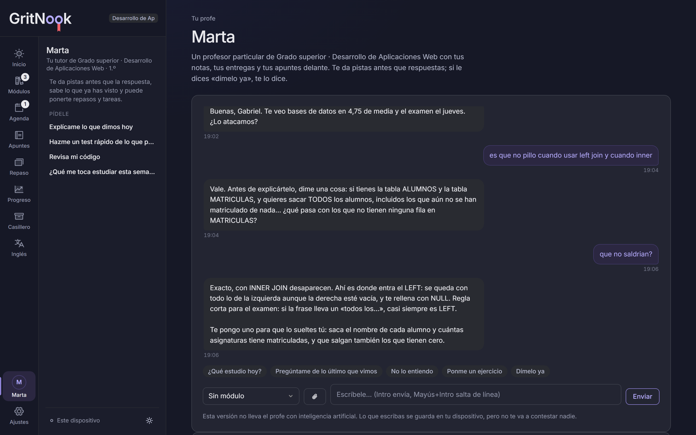

<h1><picture><source media="(prefers-color-scheme: dark)" srcset="marca/gritnook-oscuro.svg"></picture></h1>

**El estudio que se adapta a tu vida.** GritNook encaja lo que tienes que estudiar en el tiempo que de verdad tienes libre: alrededor de tus clases, de tu trabajo y de todo lo demás.

App de estudio que se acomoda a lo que estudies: le dices si vas a la ESO, a Bachillerato, a un ciclo de FP, a la universidad, a una oposición o a un idioma, y monta tus asignaturas, tus horas y un tutor que sabe de lo tuyo. Con apuntes en libreta de cuadrícula donde se escribe **y se dibuja**, notas de cada asignatura con lo que falta para aprobar, control de horas, entregas, documentos e inglés.

**[Probarla en vivo →](https://gritnook.com/)**

Con cuenta (correo y contraseña), lo tuyo te sigue del móvil al ordenador; los datos viven en Europa. **TutorIA** (el profe con inteligencia artificial) y **ChatClase** (el chat de la comunidad) salen como *Próximamente*: los dos están hechos y probados por dentro, y un interruptor en el código (`PROFE_ACTIVO`, `CHAT_ACTIVO`) los enciende cuando estén los papeles. Cómo, en [CUENTAS.md](CUENTAS.md).



## Por qué

Llevar un curso es llevar la cuenta de seis o siete asignaturas a la vez: qué has sacado, cuánto necesitas en lo que queda, qué entregas se te echan encima, cuántas faltas te puedes permitir y dónde apuntaste aquello. Eso acaba repartido entre una libreta, el móvil y la memoria. Aquí está todo en un sitio, y los números los hace la app.

## Se acomoda a ti

La primera vez no hay una app vacía esperando que la rellenes: hay siete pasos.

1. **Quién eres y qué estudias** — ESO, Bachillerato, grado medio, grado superior, universidad, oposiciones, idiomas u otra cosa.
2. **Tu curso** — el curso y la modalidad, el ciclo, el grado o la plaza.
3. **Tus asignaturas** — propuestas del catálogo (ESO y Bachillerato por modalidad, DAW, DAM, ASIR, Administración y Finanzas, Educación Infantil, SMR, Gestión Administrativa, Cuidados Auxiliares de Enfermería…, ya con los módulos comunes de la FP nueva del curso 24/25) y, si abres la app desde Claude, la lista real de tu curso con un resumen del temario de cada una. Todo editable: quita, añade, renombra.
4. **Si trabajas** — y cuántas horas puedes estudiar de verdad a la semana. Las horas se reparten entre las asignaturas según su peso.
5. **Cómo te evalúan** — plantilla por etapa (colegio, FP, universidad, oposición, idiomas) y ajustable asignatura por asignatura.
6. **Cómo quieres que te trate el tutor** — tono, cuánta caña, cuántos mensajes al día y si puede ponerte cosas por su cuenta.
7. **Listo.**

Quien ya tenía datos no pasa por ahí: el perfil se rellena con lo que había y no se toca nada.

## Qué hace

**Tu día.** El Inicio empieza por lo que importa hoy, no por un saludo: cuánto te toca estudiar según tu tiempo libre y si trabajas, por dónde empezar y qué vence en dos días, con un botón para arrancar el cronómetro. Al lado, **el tiempo de tu zona** con un consejo para estudiar («Llueve: perfecto para un par de bloques»), si quieres: la ciudad se guarda solo en tu dispositivo.

**Asignaturas y notas.** Un resumen del curso —tu media, cuántas van bien y las horas de la semana— y una **ficha por asignatura**: un anillo con la nota que llevas y la marca de tu objetivo, una frase que dice qué te toca («Toca apretar: necesitas un 7,25 de media en el 40 % que queda»), las notas de cada apartado con lo que aporta cada uno, las faltas contra el máximo permitido y el estudio de la semana. Calcula la media ponderada y, sobre todo, **qué nota necesitas en lo que queda**. Todo se guarda mientras escribes. Cada asignatura tiene su color.

**Apuntes en libreta de verdad.** Papel de cuadrícula, rayas, puntos o liso, con su margen rojo. Al escribir: negrita, cursiva, subrayado, tachado, títulos, listas con viñetas o numeradas, subrayado del texto en doce tonos pastel y color de letra. Al dibujar: bolígrafo, rotulador, subrayador (doce pastel), diez tintas y un color libre, formas (línea, flecha, rectángulo, círculo) con imán a la cuadrícula y rayas rectas con Mayús. Letra normal o escrita a mano (cuatro manuscritas) que se queda para todos tus apuntes. Modo concentración para quedarte solo con la hoja. La goma **corta el trazo por donde pasa** en vez de borrarlo entero, como una goma de verdad. Deshacer y rehacer sin límite, también para el texto.

**El texto se coloca donde quieras.** Sangría cuadro a cuadro con Tab (y columnas con Tab en mitad de la línea), subir y bajar líneas con Alt+↑↓, duplicarlas con Alt+Mayús+↓ y alinearlas al centro o a la derecha. Junto a la línea del cursor sale un **asa en el margen**: se arrastra arriba, abajo o a los lados para mover las líneas (y por debajo del texto deja huecos en blanco), y al tocarla sale un menú para copiar, cortar, duplicar o borrar. **Tocando en blanco se escribe justo ahí**, en el cuadro que tocas. Lo que copias de la hoja se pega con sus subrayados y colores; lo de otras webs, Docs o Word entra con su forma (títulos, listas, negrita, sangrías) pero sin sus colores; y el texto con guiones, números o # se convierte en listas y títulos. Ctrl+Mayús+V pega el texto sin más.

**La hoja es un folio A4** (800 × 1128) y crece por folios enteros, con la raya
entre uno y otro y su número. **En el móvil, pensada para el dedo**, con tres modos
abajo: **Folio** para moverte por la hoja A4 como por una foto (un dedo mueve, dos
acercan, doble toque en blanco acerca o vuelve a la hoja entera, y tocando una línea
escribes en ella), **Escribir** y **Dibujar**. Las herramientas del ordenador están
todas, por categorías y sin deslizar: Formato, Párrafo, Colocar (las flechas) y
Subrayar. Al escribir, la hoja se pone al ancho de la pantalla con letra de 16 px, sin ir de lado, y la barra baja a una tira con botones grandes que va siempre encima del teclado. Al dibujar se ve la hoja entera: con un dedo se dibuja y con dos se acerca (hasta el 400 %) y se mueve; con lápiz, el dedo solo mueve la hoja y la mano apoyada no pinta. Con un apunte abierto no estorban ni la lista ni el menú, y una flecha te devuelve a tus apuntes.





**Horas y cronómetro.** Pomodoro por asignatura que se queda a mano debajo del menú, en cualquier sección, para pararlo o seguir sin moverte. Al acabar la concentración te para con un «bien hecho» y el descanso lo empiezas tú. Con el reparto de la semana y la meta semanal de cada una.

**Agenda.** Entregas y exámenes en una sola base de datos que se ve como **calendario**, **tablero** (pendiente, en curso, hecho) o **lista**. Se añade escribiendo normal —«Examen de BD el jueves a las 10»— y la app entiende el tipo, la asignatura, el día y la hora; se mueve arrastrando; y cada cosa se abre en un panel lateral para editarla sin botón de guardar, con sus pasos y sus notas. Los exámenes llevan cuenta atrás y un plan de estudio hacia atrás, automático o hecho por el tutor. Más tu horario de clases y el **plan de la semana**, que sale solo de tus horas, tus días libres, tus exámenes y lo que peor llevas, y se va tachando al estudiar con el cronómetro. GritNook te dice cada día qué te toca.

**Casillero.** Una estantería con una libreta en 3D por asignatura, con las anillas del logo en el lomo, su etiqueta de papel, su goma y su símbolo, y **del color que tú elijas** para cada una; al abrirla, la tapa gira y las hojas se abren en abanico; los folios asoman cuando tiene hojas. Al abrirla salen sus hojas con vista previa —la primera página de cada PDF, las primeras líneas de cada texto o código, la foto o la web del enlace— para verlas (los PDF, dentro de la app), descargar o **pasárselas al profe** y preguntarle. Se sueltan archivos encima de una libreta y se guardan en ella. Buscador en todas las libretas, filtro por tipo y las libretas de lo que tienes esta semana. Dentro de Claude los archivos van a su almacén (hasta 20 MB cada uno, las fotos grandes se reducen solas); fuera, se guardan en la app hasta 180 KB.

**Inglés.** Traductor a mano, vocabulario propio y repaso espaciado de las palabras que te tocan.

**Objetivos del día.** Se cumplen solos con lo que ya haces: estudiar con el cronómetro, tachar una entrega, escribir un apunte, repasar tarjetas. Con su racha de la semana.

**Repaso.** Tarjetas con repaso espaciado —vuelven justo cuando estás a punto de olvidarlas— y tests tipo examen, a mano o sacados de tus apuntes por el tutor. Lo que fallas en un test pasa a tarjetas.

**Progreso.** Horas por semana y asignatura, la nota de cada una contra tu objetivo y cómo ha ido cambiando, y los exámenes hechos.

**Oposiciones.** Para cualquier oposición sin elegirla de una lista: pegas el índice del temario tal cual sale en la convocatoria y cada línea se convierte en un tema, agrupado por bloques. Cada tema lleva sus **vueltas** con fecha, se marca como dominado o difícil, se le enlaza la ley del BOE y se le escriben notas. Los temas que llevas tiempo sin tocar **se enfrían** y la app te los devuelve, igual que las tarjetas de repaso. Con las reglas de tu examen —preguntas, opciones, lo que resta cada fallo y la nota de corte— te dice **cuántas tienes que acertar** según cuántas dejes en blanco, y **si compensa contestar o dejarla en blanco** cuando descartas una opción. Los simulacros se apuntan y se ven en una gráfica contra el corte, y el **plan de vueltas** calcula cuántos temas por día hacen falta para llegar a la fecha y si a tu ritmo llegas. Si ya venías estudiando, marcas de golpe **lo que ya llevas**. El cronómetro se pone con un tema y apunta sus horas; el **simulacro con reloj** va con los minutos del examen y sin pausa; al apuntarlo dices de qué temas eran los fallos y esos temas salen como flojos. Cada pregunta que fallas se guarda como **tarjeta de repaso del tema**. Si hay tema a desarrollar, calcula la **probabilidad de que salga uno que llevas** según las bolas que se sacan, y hace sorteos de prueba. Avisa del **plazo de la solicitud**, que es el despiste que más plazas cuesta, enseña tus últimos siete días contra los anteriores y descarga el temario para Excel. El profe se convierte en tu preparador, con la orden de no inventarse nunca un artículo de ley, y te pregunta tipo test del tema que elijas. La app no trae temarios ni preguntas: eso es el negocio de las academias y tiene sus derechos.

**El tutor.** Un profesor particular de lo que estudies: no suelta la respuesta a la primera —pista, pregunta, ejemplo parecido y, si hace falta, la explicación entera—, conoce el temario de tus asignaturas, tus notas, tus entregas y de qué tienes apuntes, te escribe él cuando algo se acerca y puede ponerte repasos, entregas y objetivos. Se le pueden pasar capturas (pegadas con Ctrl+V o arrastradas) y archivos de código o texto para que los revise. Es especialista solo en el curso que marcas y tiene normas de profesor que no se desactivan: solo responde dudas de tus estudios o dudas profesionales de tu sector —a todo lo demás contesta con una frase fija y te devuelve a lo tuyo, sin entrar en lo personal ni en temas fuera de clase—, no hace los trabajos por ti, dice siempre que es una IA y, si alguien lo está pasando mal de verdad, le anima a pedir ayuda y le da el 024.



**TutorIA y ChatClase, próximamente.** Abajo del menú, aparte, con «Próximamente» en naranja y un avance de lo que harán. ChatClase está entero por dentro —canales por tema, emojis y reacciones, responder, editar, adjuntar apuntes y fotos, compartir tus tareas hechas o pendientes, fijar, reportar, bloquear y moderar—, para ordenador y móvil, con su base de datos y sus pruebas. Pensado para que haya menores: sin mensajes privados, solo un apodo y con normas que se aceptan al entrar.

**Menú.** En el ordenador, un riel con cada sección y su nombre, siempre en el mismo sitio, y al lado un panel con lo que hay dentro de la sección en la que estás: tus apuntes con buscador, lo pendiente de la agenda agrupado por fechas, tus asignaturas con su estado… En el móvil, una barra de pestañas abajo y un «Más» con el resto de secciones y su dato al día. Las confirmaciones (borrar algo, cargar una copia) son ventanas de la propia app, nunca las del navegador.

**Un Inicio a tu manera.** Con *Editar Inicio*, cada panel se arrastra por su nombre a cualquier sitio y se estira por la esquina, como los widgets del móvil; los que no uses se ocultan. Por debajo es una rejilla de 12 columnas, así que nunca queda un panel encima de otro y el mismo Inicio vale en un portátil y en un monitor grande. En el móvil los paneles van uno debajo de otro, con su propio orden. También con el teclado: flechas para mover y Mayúsculas con flechas para el tamaño. Mientras no toques nada, el Inicio es el de siempre.

**Ajustes.** Perfil, asignaturas con su color, plantilla de evaluación, cronómetro, el tutor —con un interruptor para apagarlo del todo, y entonces no sale nada hacia ninguna IA—, tema, copia de seguridad en JSON y los cuatro documentos legales, que se leen dentro de la app.

## Cómo está hecho

Un solo archivo HTML. **Sin frameworks, sin dependencias, sin proceso de compilación**: HTML, CSS y JavaScript a pelo. Las letras van dentro; de fuera solo se pide PDF.js al abrir un PDF, el tiempo a Open-Meteo si pones tu ciudad y tu cuenta a Supabase.

- **Dibujo vectorial sobre canvas.** Los trazos se guardan como puntos, no como imagen: se redibujan nítidos a cualquier escala y ocupan poco. Suavizado con curvas cuadráticas, simplificación Ramer–Douglas–Peucker al soltar el trazo, dos capas de canvas con `mix-blend-mode: multiply` para que los rotuladores se superpongan como la tinta, y eventos de puntero con `getCoalescedEvents` para no perder resolución al dibujar rápido.
- **La goma que corta.** Cada trazo se remuestrea, se quitan los puntos que caen bajo la goma y cada tramo que sobrevive pasa a ser un trazo nuevo, conservando sus vértices originales. Las formas se convierten a su contorno para poder cortarlas igual.
- **Texto con formato mínimo.** El apunte se guarda dos veces: en HTML reducido (solo negrita y saltos) para mostrarlo y en texto plano para buscar y para la IA. Lo que se pega entra limpio, sin estilos de la web de origen.
- **Sistema de diseño en tokens.** Rampas de neutros y de acento, el acento siempre como línea o borde, elevación de 1 px más oscuridad ambiental, y un color por asignatura validado: contraste mínimo de 3:1 contra la superficie y separación suficiente entre tonos vecinos también para quien no distingue rojos y verdes.
- **Logotipo e iconos.** El logotipo sale de los trazos de Inter con las dos «o» cambiadas por anillas de libreta ([marca/generar.js](marca/generar.js)), así que se ve igual aunque la fuente no cargue. Los iconos del menú son de Phosphor, copiados dentro del archivo. Créditos y licencias en [CREDITOS.md](CREDITOS.md).
- **Accesible.** Contraste AA comprobado en los dos temas, navegación por teclado, roles ARIA y respeto a `prefers-reduced-motion`.

## Probarla en local

Descarga el repositorio y abre `index.html` con doble clic. Funciona sin servidor.

Si prefieres servirla:

```bash
node servidor.js
```

Y abre http://localhost:4173

**Tus datos, a salvo.** Todo vive en tu navegador, así que la app se ocupa de que no se pierda: le pide al navegador que **no borre** lo guardado cuando ande justo de espacio, avisa si llevas semanas sin descargar una copia y, en el iPhone, te explica por qué conviene añadirla a la pantalla de inicio (Safari borra lo de las webs que no abres en siete días). Con **dos pestañas abiertas a la vez** ninguna pisa a la otra: cada una se entera de lo que guardan las demás. Y si algo se rompe, **Ajustes → Datos → Contar un fallo** copia lo técnico —navegador, versión, tamaño de pantalla— sin tu nombre, tus notas ni tus apuntes.

**Tus fechas, en el calendario del móvil.** La app no puede avisarte si no la abres, así que exporta tus exámenes y entregas en un archivo `.ics` que el teléfono mete en su calendario, con aviso el día antes y otro una hora antes de un examen. Si opositas, también la fecha del examen y el último día para presentar la solicitud.

## Instalarla en el móvil

Desde GitHub Pages, o en local con `node servidor.js`, la app se instala como una más: en el móvil, menú del navegador → *Añadir a pantalla de inicio*; en el ordenador, el icono de instalar de la barra de direcciones. Funciona sin conexión. **En el iPhone conviene hacerlo**: Safari borra lo que guarda una web si pasas siete días sin abrirla, y desde la pantalla de inicio eso no pasa.

## Dos versiones, una base

El mismo archivo corre en dos sitios con capacidades distintas:

| | GitHub Pages | Dentro de Claude |
|---|---|---|
| Apuntes, libreta, notas, horas, entregas, ajustes | Sí | Sí |
| Dónde se guarda | En tu cuenta de GritNook (correo y contraseña), sincronizado entre dispositivos y también sin conexión | En tu cuenta de Claude, sincronizado entre dispositivos |
| Tutor, lista de asignaturas por IA, tarjetas y tests del tutor, traductor | No | Sí |
| Instalable y sin conexión | Sí | No |

La versión pública es para verla y probarla. La de Claude usa sus capacidades de sincronización e IA, que solo existen cuando la página se abre desde allí; el código detecta si están disponibles y, si no, esconde o explica lo que no puede funcionar en vez de fallar.

## Dársela a alguien para que la pruebe

[PROBARLA.md](PROBARLA.md) es la página para pasarle a quien vaya a probarla: qué es, cómo instalarla en el móvil, dónde se guardan sus datos y qué mirar. Los fallos se cuentan desde **Ajustes → Datos → Contar un fallo**, que copia el navegador y la versión sin llevarse nada personal.

## Pruebas

```bash
node pruebas/correr.js
```

737 pruebas que corren **dentro de la app de verdad**, cargada en un iframe, sin
instalar nada. Cubren las cuentas de las notas, entender las fechas escritas a
mano, el sanitizador, el estado, la libreta, el repaso espaciado, la pantalla de
bienvenida entera, el modo opositor, las cuentas contra un servidor de mentira y una tanda de datos absurdos a propósito. Las reglas de la base de datos, aparte, contra un Postgres de verdad. El cómo y lo que han encontrado, en [pruebas/](pruebas/LEEME.md).

## Base de datos

Cuentas de usuario con **Supabase** (PostgreSQL, en Irlanda, en la UE): cada uno entra con
su correo y su contraseña, y la base de datos solo le deja leer y escribir lo
suyo (Row Level Security). El creador tiene un panel con cuántos la usan y cuánto,
sin ver el contenido de nadie. Todo en [backend/](backend/LEEME.md): el SQL, sus
pruebas y qué cambia al guardar datos de otra gente. Sin configurar, la app
funciona como antes, cada navegador con lo suyo.

## El plan

GritNook se publica gratis. El porqué, las cuentas de venderla y qué haría falta para cobrar están en [CUENTAS.md](CUENTAS.md).

## Licencia

Todos los derechos reservados — ver [LICENSE](LICENSE). El código está publicado para leerlo y
estudiarlo, no para copiarlo ni usarlo en otro producto. Las piezas de terceros mantienen sus
licencias libres, detalladas en [CREDITOS.md](CREDITOS.md).

Qué datos guarda la aplicación y qué sale de ella: [DATOS.md](DATOS.md).

Los papeles —privacidad, términos de uso, aviso legal y aviso sobre la IA— están en
[legal/](legal/LEEME.md), y se leen también dentro de la app, en Ajustes → Legal. Los `.md`
mandan: `marca/` tiene el logotipo y `legal/` los textos, que se meten en la app con un script.
